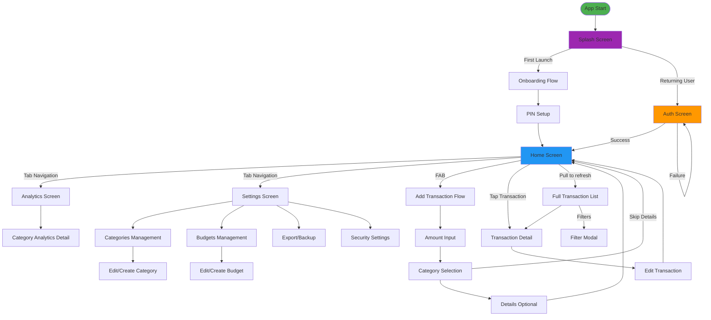

# Navigation Map - FinTrack

This document describes the navigation structure and screen flow for the FinTrack mobile application.

**Navigation Library**: React Navigation (`@react-navigation/native` with `@react-navigation/native-stack` and `@react-navigation/bottom-tabs`) is used for navigation in FinTrack.

---

## Overview

Navigation Map is a visual representation of all screens in the application and how they connect to each other. It helps developers understand:

- Screen hierarchy and relationships
- User flow paths
- Navigation patterns used
- Screen parameters and data passing
- Deep linking structure (future)

---

## High-Level Navigation Structure



---

## Navigation Stack Structure

### 1. Auth Stack (Pre-authentication)

```
AuthStackNavigator
├── SplashScreen
│   └── Initial screen, checks if user is authenticated
│
├── OnboardingStack
│   ├── OnboardingScreen1
│   │   └── "Take Control of Your Finances"
│   ├── OnboardingScreen2
│   │   └── "Plan Your Budget"
│   └── OnboardingScreen3
│       └── "Your Data is Protected"
│
└── AuthScreen
    ├── PINEntryScreen
    │   └── 4-digit PIN entry with biometric option
    └── BiometricPrompt (modal)
        └── Face ID / Touch ID / Fingerprint
```

**Navigation Flow:**

- First launch: `Splash → Onboarding (3 screens) → PIN Setup → Home`
- Returning user: `Splash → Auth (PIN/Biometric) → Home`
- Failed auth: `Auth → Auth` (with cooldown after 3 failures)

### 2. Main Stack (Post-authentication)

```
MainTabNavigator
├── HomeTab
│   ├── HomeScreen
│   │   ├── Monthly balance card
│   │   ├── Recent transactions list
│   │   └── FAB (+) button
│   │
│   ├── TransactionListScreen
│   │   ├── Full transaction list with filters
│   │   ├── Search functionality
│   │   └── Pull to refresh
│   │
│   ├── TransactionDetailScreen
│   │   ├── Transaction details
│   │   ├── Edit button
│   │   └── Delete button
│   │
│   └── AddTransactionStack
│       ├── AmountInputScreen
│       │   ├── Numeric keypad
│       │   └── Income/Expense toggle
│       │
│       ├── CategorySelectionScreen
│       │   ├── Category grid/list
│       │   └── Create category option
│       │
│       └── TransactionDetailsScreen (optional)
│           ├── Date picker
│           └── Note input
│
├── AnalyticsTab
│   ├── AnalyticsScreen
│   │   ├── Pie chart (expenses by category)
│   │   ├── Line chart (trends)
│   │   ├── Summary cards
│   │   └── Period selector (Week/Month/Year)
│   │
│   └── CategoryAnalyticsScreen
│       ├── Category-specific analytics
│       └── Transaction list for category
│
└── SettingsTab
    ├── SettingsScreen
    │   ├── Security section
    │   ├── Data section
    │   └── App section
    │
    ├── CategoriesScreen
    │   ├── Expense categories list
    │   ├── Income categories list
    │   └── Drag to reorder
    │   │
    │   └── CategoryEditScreen
    │       ├── Create/Edit category
    │       ├── Name, icon, color
    │       └── Delete option
    │
    ├── BudgetsScreen
    │   ├── Budget list with progress
    │   └── Create budget button
    │   │
    │   └── BudgetEditScreen
    │       ├── Create/Edit budget
    │       ├── Category selection
    │       ├── Amount input
    │       └── Notifications toggle
    │
    ├── SecurityScreen
    │   ├── Biometric toggle
    │   ├── Change PIN option
    │   └── Auto-lock settings
    │   │
    │   └── ChangePINScreen
    │       ├── Current PIN entry
    │       └── New PIN setup
    │
    └── ExportScreen
        ├── Export to CSV
        ├── Create Backup
        ├── Restore from Backup
        └── Delete All Data
```

---

## Screen Details

### Authentication Screens

| Screen               | Type  | Navigation | Parameters  | Description                       |
| -------------------- | ----- | ---------- | ----------- | --------------------------------- |
| **SplashScreen**     | Stack | Root       | -           | Initial screen, checks auth state |
| **OnboardingScreen** | Stack | Sequential | `step: 1-3` | First-time user introduction      |
| **PINSetupScreen**   | Stack | Modal      | -           | Create 4-digit PIN                |
| **AuthScreen**       | Stack | Root       | -           | PIN entry / Biometric prompt      |

### Main App Screens

| Screen                       | Type  | Navigation | Parameters                     | Description                 |
| ---------------------------- | ----- | ---------- | ------------------------------ | --------------------------- |
| **HomeScreen**               | Tab   | Root       | -                              | Main dashboard              |
| **TransactionListScreen**    | Stack | Push       | `filters?: FilterParams`       | Full transaction list       |
| **TransactionDetailScreen**  | Stack | Push       | `transactionId: string`        | Transaction details         |
| **AmountInputScreen**        | Stack | Push       | `type: 'income' \| 'expense'`  | Transaction amount input    |
| **CategorySelectionScreen**  | Stack | Push       | `type`, `amount`               | Select transaction category |
| **TransactionDetailsScreen** | Stack | Push       | `transaction: TransactionData` | Optional date/note          |
| **AnalyticsScreen**          | Tab   | Root       | -                              | Analytics dashboard         |
| **CategoryAnalyticsScreen**  | Stack | Push       | `categoryId`, `period`         | Category-specific analytics |
| **SettingsScreen**           | Tab   | Root       | -                              | App settings                |
| **CategoriesScreen**         | Stack | Push       | -                              | Category management         |
| **CategoryEditScreen**       | Stack | Push       | `categoryId?: string`          | Create/edit category        |
| **BudgetsScreen**            | Stack | Push       | -                              | Budget management           |
| **BudgetEditScreen**         | Stack | Push       | `budgetId?: string`            | Create/edit budget          |
| **SecurityScreen**           | Stack | Push       | -                              | Security settings           |
| **ChangePINScreen**          | Stack | Push       | -                              | Change PIN                  |
| **ExportScreen**             | Stack | Push       | -                              | Data export/backup          |

---

## Navigation Patterns

### 1. Tab Navigation (Bottom Tabs)

**Used for:** Main app sections

- **Home Tab**: Dashboard and transactions (default)
- **Analytics Tab**: Charts and insights
- **Settings Tab**: App configuration

**Characteristics:**

- Always visible at bottom
- Maintains state when switching tabs
- Badge indicators (future: budget warnings)

### 2. Stack Navigation

**Used for:**

- Authentication flow
- Transaction flow (multi-step)
- Detail screens
- Settings sub-screens

**Characteristics:**

- Header with back button
- Stack history maintained
- Can push/pop screens

### 3. Modal Navigation

**Used for:**

- Add Transaction flow (full-screen modal)
- Filter modal
- Date picker
- Category picker (if implemented as modal)

**Characteristics:**

- Overlays current screen
- Dismissible (swipe down or close button)
- Can pass data back to previous screen

---

## User Flow Mappings

### First Launch Flow

```
Splash Screen
  ↓
Onboarding Screen 1 → Onboarding Screen 2 → Onboarding Screen 3
  ↓ (or Skip)
PIN Setup Screen
  ↓
Home Screen
```

### Returning User Flow

```
Splash Screen
  ↓
Auth Screen (PIN / Biometric)
  ↓ (Success)
Home Screen
  ↓ (Failure - 3 attempts)
Cooldown (30 seconds)
  ↓
Auth Screen
```

### Add Transaction Flow

```
Home Screen (FAB +)
  ↓
Amount Input Screen
  ↓ (Next)
Category Selection Screen
  ↓ (Select category)
  ├─→ Transaction Details Screen (optional)
  │     ↓ (Save)
  └─→ Home Screen (skip details)
```

### View Transaction Flow

```
Home Screen
  ↓ (Tap transaction)
Transaction Detail Screen
  ├─→ Edit Transaction Screen
  │     ↓ (Save)
  └─→ Home Screen
  ↓ (Delete)
Confirmation Modal
  ↓ (Confirm)
Home Screen
```

### Analytics Flow

```
Home Screen
  ↓ (Analytics tab)
Analytics Screen
  ↓ (Tap category in chart)
Category Analytics Screen
  ↓ (Back)
Analytics Screen
```

### Settings Flow

```
Home Screen
  ↓ (Settings tab)
Settings Screen
  ├─→ Categories Screen
  │     ├─→ Category Edit Screen (create)
  │     └─→ Category Edit Screen (edit)
  │
  ├─→ Budgets Screen
  │     ├─→ Budget Edit Screen (create)
  │     └─→ Budget Edit Screen (edit)
  │
  ├─→ Security Screen
  │     └─→ Change PIN Screen
  │
  └─→ Export Screen
```

---

## References

- [FinTrack PRD](../../fintrack-prd-en.md) - User flows section
- [FinTrack Spec](../../fintrack-spec-en.md) - Technical requirements
- [React Navigation Documentation](https://reactnavigation.org/)
