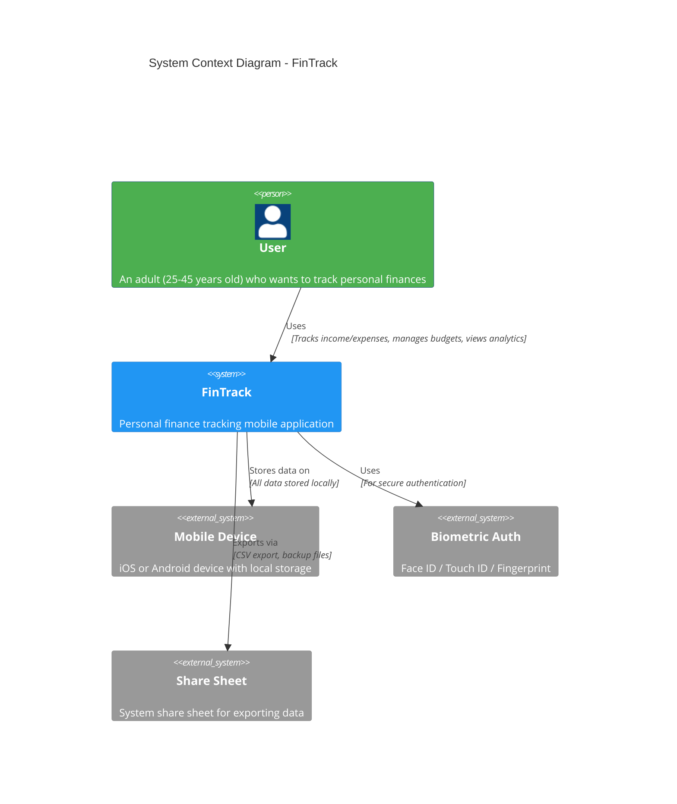
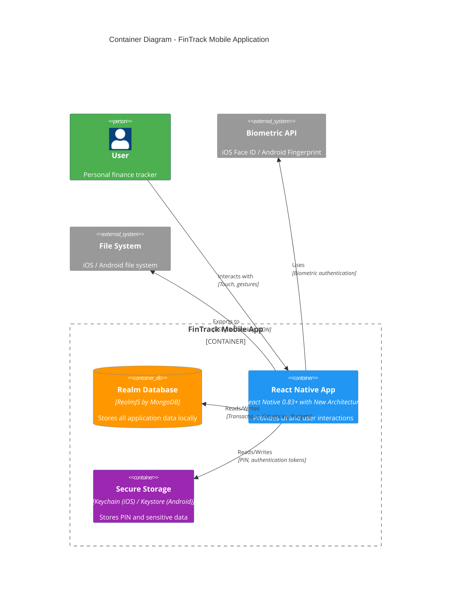
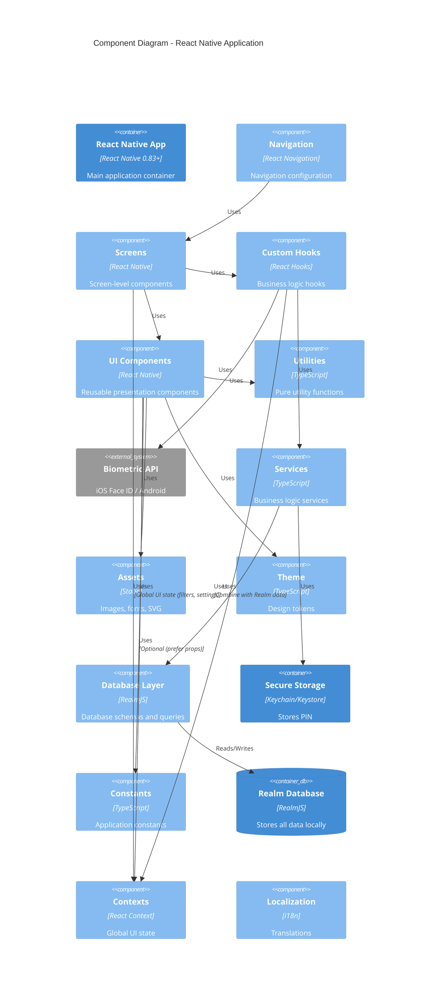

# FinTrack - C4 Architecture Diagrams

This document contains C4 model diagrams for the FinTrack personal finance tracking application. The C4 model provides different levels of abstraction to understand the system architecture.

## Diagram Levels

1. **Context Diagram (Level 1)**: System and its users
2. **Container Diagram (Level 2)**: High-level technical building blocks
3. **Component Diagram (Level 3)**: Components within a container

---

## Level 1: System Context Diagram

Shows the FinTrack system and its relationships with users and external systems.

**Key Points:**

- FinTrack is a standalone mobile application with no cloud dependencies
- All data is stored locally on the device
- Uses system biometric authentication APIs
- Exports data via system share sheet

---

## Level 2: Container Diagram

Shows the high-level technical building blocks (containers) that make up the FinTrack application.

**Key Containers:**

- **React Native App**: Main application container with UI and business logic
- **Realm Database**: Local-first database for all application data
- **Secure Storage**: System-provided secure storage for authentication credentials

---

## Level 3: Component Diagram - React Native App

Shows the components within the React Native application container, organized by architectural layers.

**Key Components:**

### Presentation Layer

- **Screens**: Screen-level components that compose UI and use hooks
- **Components**: Pure presentation components with zero dependencies on business logic
- **Navigation**: Navigation configuration

### Business Logic Layer

- **Hooks**: Custom React hooks encapsulating business logic (consumed only by screens)
- **Services**: Business logic services handling data operations

### Data Layer

- **State Management**: React Context for global UI state, Realm hooks for business data (see ADR-003)
- **Database Layer**: Realm schemas, models, and queries

### Infrastructure Layer

- **Utilities**: Pure utility functions
- **Theme**: Design tokens
- **Constants**: Application constants
- **Assets**: Static assets
- **Localization**: Translations

---

**Note**: For detailed component specifications, see [Layered Architecture Implementation Guide](../guides/layered-architecture-implementation.md).

---

## Data Flow

For detailed data flow diagrams and sequence diagrams of key user flows, see [Data Flow Diagrams](./data-flow.md).

---

## Technology Stack

| Layer                | Technology                                                                                                              |
| -------------------- | ----------------------------------------------------------------------------------------------------------------------- |
| **Framework**        | React Native 0.83+ with New Architecture                                                                                |
| **Language**         | TypeScript (strict mode)                                                                                                |
| **Database**         | RealmJS by MongoDB                                                                                                      |
| **Navigation**       | React Navigation (`@react-navigation/native` with `@react-navigation/native-stack` and `@react-navigation/bottom-tabs`) |
| **State Management** | React Context + Realm hooks (`@realm/react`) - see ADR-003                                                              |
| **Testing**          | Jest, React Native Testing Library                                                                                      |
| **Crash Reporting**  | Sentry                                                                                                                  |
| **CI/CD**            | GitHub Actions                                                                                                          |

---

## Key Architectural Principles

1. **Layered Architecture**: Clear separation between Presentation, Business Logic, Data, and Infrastructure layers
2. **Dependency Rule**: Dependencies point inward - screens → components → hooks/services → db
3. **Zero Dependencies for Components**: Components have zero dependencies on business logic (hooks, services)
4. **Hooks Only in Screens**: Hooks are consumed only by screens, never by components
5. **Offline-First**: All data stored locally, no cloud dependencies
6. **Security**: PIN and biometric authentication, secure local storage

---

## References

- [ADR-001: Architectural Approach](../adr/ADR-001-high-level-architecture.md)
- [ADR-002: Project Structure](../adr/ADR-002-project-structure.md)
- [ADR-003: State Management](../adr/ADR-003-state-management.md)
- [Layered Architecture Implementation Guide](../guides/layered-architecture-implementation.md)
- [C4 Model](https://c4model.com/)
