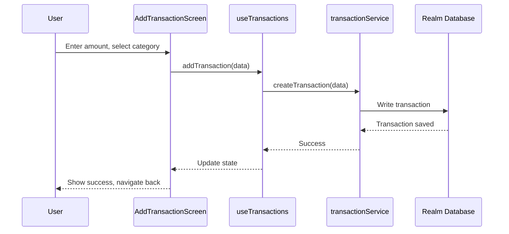
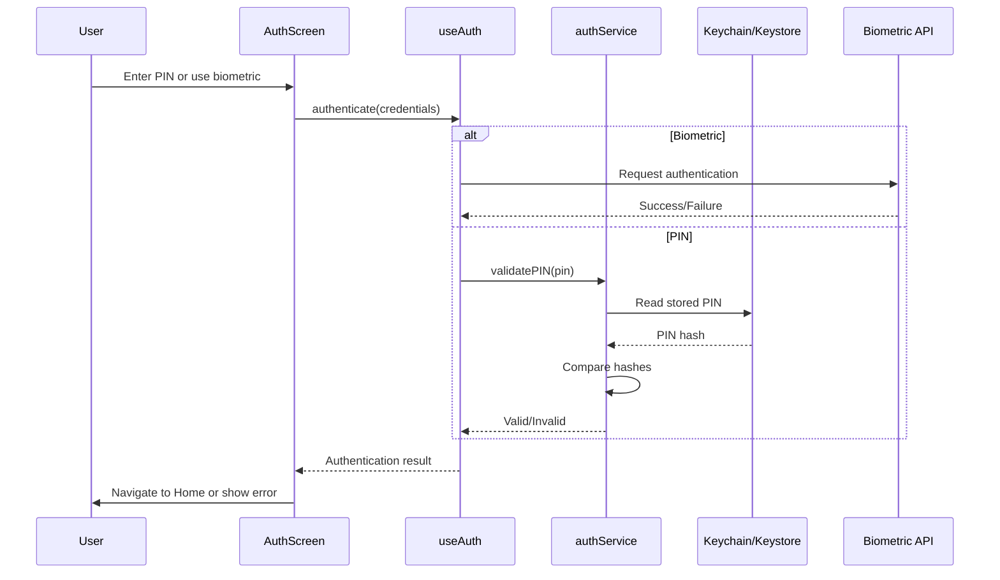
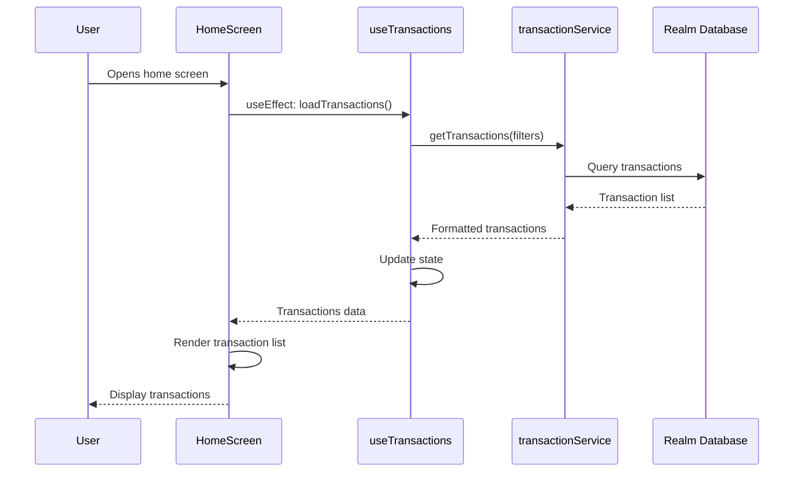
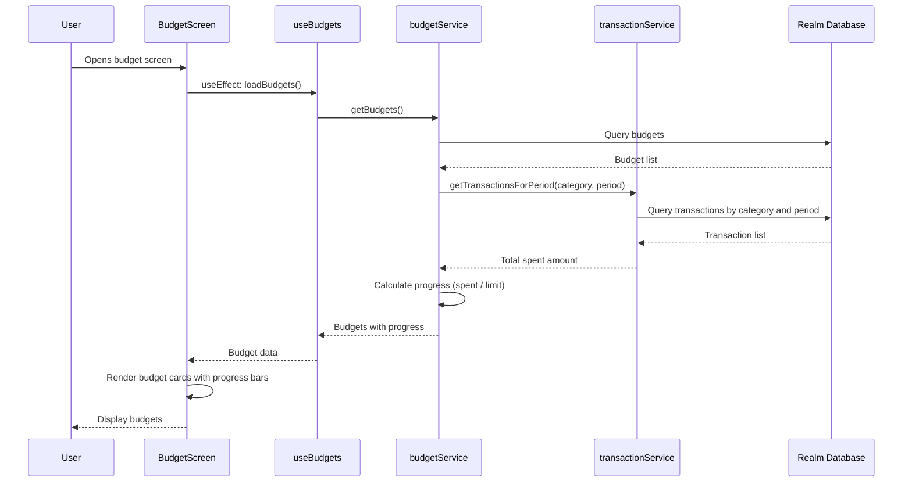
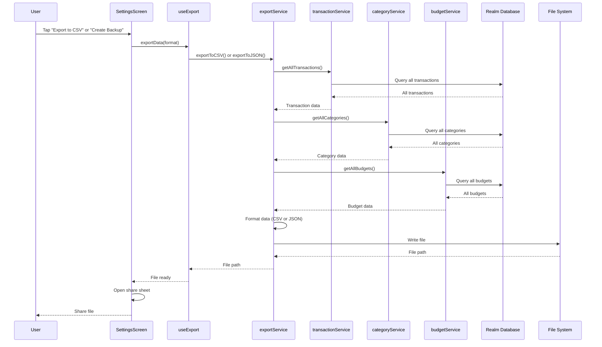

# FinTrack - Data Flow Diagrams

This document describes the data flow and interaction sequences for key user flows in the FinTrack application.

For system architecture overview, see [C4 Diagram](./c4-diagram.md).

---

## Adding a Transaction

Sequence diagram showing the flow when a user adds a new transaction.

**Flow Description:**

1. User enters transaction details (amount, category, optional date/note) in the `AddTransactionScreen`
2. Screen calls `addTransaction()` from `useTransactions` hook
3. Hook calls `createTransaction()` in `transactionService`
4. Service writes the transaction to Realm database
5. Database confirms successful save
6. Success propagates back through service → hook → screen
7. Screen updates UI and navigates back to home

**Key Points:**

- Screen only uses hooks, never directly calls services
- Service handles all database operations
- Database operations are synchronous (Realm)

---

## Authentication Flow

Sequence diagram showing the authentication process with PIN or biometric authentication.

**Flow Description:**

1. User enters PIN or initiates biometric authentication on `AuthScreen`
2. Screen calls `authenticate()` from `useAuth` hook
3. Hook determines authentication method:
   - **Biometric**: Direct call to system Biometric API
   - **PIN**: Calls `validatePIN()` in `authService`
4. For PIN authentication:
   - Service reads stored PIN hash from secure storage (Keychain/Keystore)
   - Service compares input PIN hash with stored hash
5. Authentication result (success/failure) propagates back to screen
6. Screen navigates to Home on success or shows error on failure

**Key Points:**

- Biometric authentication bypasses service layer (direct system API)
- PIN is never stored in plaintext, only hashed
- Secure storage is platform-specific (Keychain for iOS, Keystore for Android)

---

## Viewing Transaction List

Sequence diagram showing how transactions are loaded and displayed.

**Flow Description:**

1. User opens `HomeScreen`
2. Screen's `useEffect` triggers `loadTransactions()` from `useTransactions` hook
3. Hook calls `getTransactions()` in `transactionService` with optional filters
4. Service queries Realm database for transactions
5. Database returns transaction list
6. Service formats and returns transactions to hook
7. Hook updates internal state
8. Screen receives transactions via hook state
9. Screen renders transaction list components

**Key Points:**

- Transactions are loaded reactively via hook state
- Service handles querying and formatting
- Database queries can include filters (date range, category, type)

---

## Budget Progress Calculation

Sequence diagram showing how budget progress is calculated and updated.

**Flow Description:**

1. User opens `BudgetScreen`
2. Screen loads budgets via `useBudgets` hook
3. Hook calls `getBudgets()` in `budgetService`
4. Service queries budgets from database
5. For each budget, service calculates progress:
   - Calls `transactionService` to get transactions for the category and period
   - Calculates total spent amount
   - Calculates progress percentage (spent / limit)
6. Budgets with calculated progress are returned to hook
7. Screen renders budget cards with progress bars

**Key Points:**

- Budget progress is calculated on-demand, not stored
- Service layer coordinates between budget and transaction services
- Progress calculation aggregates transactions by category and time period

---

## Export Data Flow

Sequence diagram showing the data export process (CSV or JSON backup).

**Flow Description:**

1. User initiates export from `SettingsScreen`
2. Screen calls `exportData()` from `useExport` hook with format (CSV or JSON)
3. Hook calls appropriate export method in `exportService`
4. Service collects data from multiple sources:
   - All transactions from `transactionService`
   - All categories from `categoryService`
   - All budgets from `budgetService`
5. Each service queries its data from database
6. Service formats collected data (CSV or JSON)
7. Service writes formatted file to file system
8. File path is returned to hook
9. Screen opens system share sheet with the file
10. User can save or share the file

**Key Points:**

- Export aggregates data from multiple services
- File is written to app's document directory
- System share sheet handles file sharing/saving

---

## References

- [C4 Model](https://c4model.com/)
- [C4 Diagram](./c4-diagram.md) - System architecture overview
- [ADR-001: Architectural Approach](../adr/ADR-001-high-level-architecture.md)
- [Layered Architecture Implementation Guide](../guides/layered-architecture-implementation.md)
